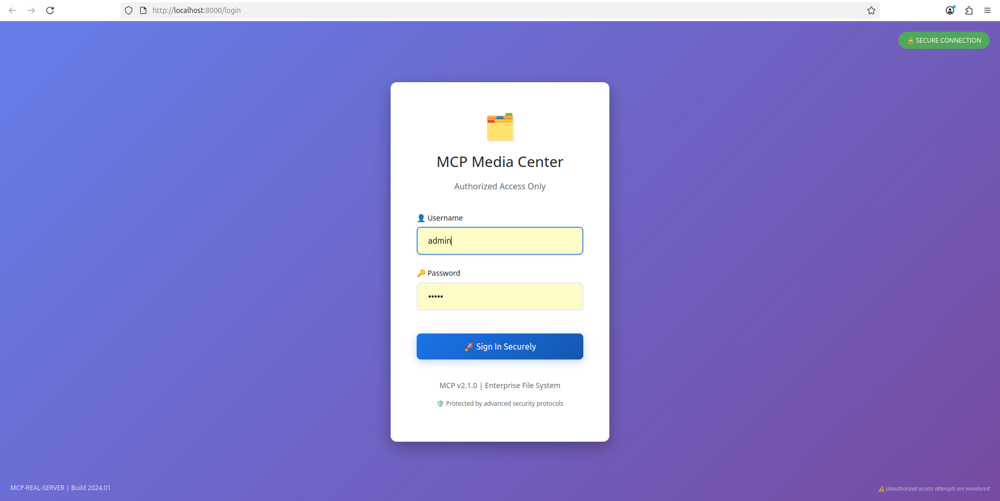
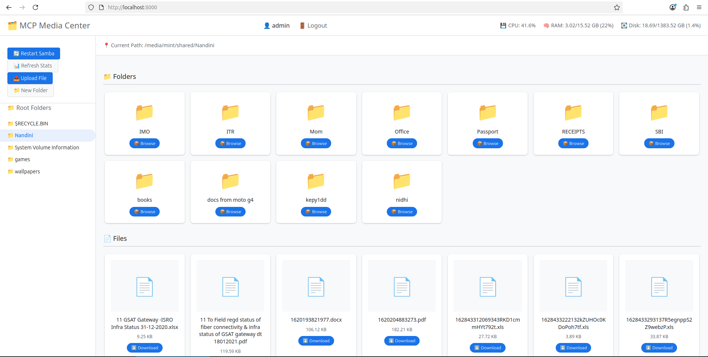
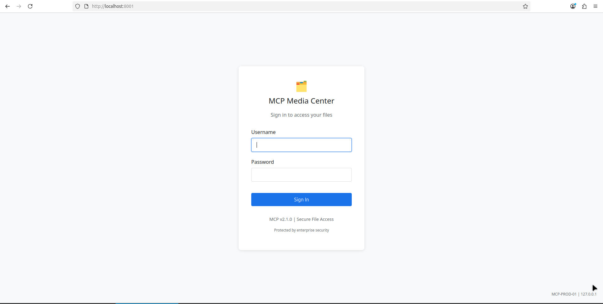
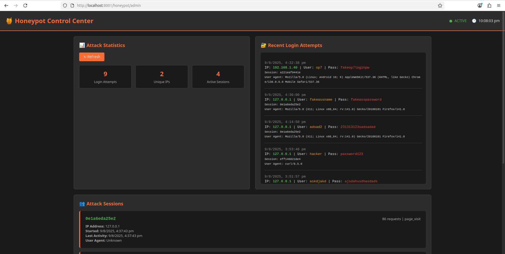

# MCP Secure Media Center with Integrated Honeypot

A professional-grade, secure file hosting system with built-in cybersecurity honeypot for threat detection and analysis. Features Google Drive-style interface, authenticated access, and real-time attack monitoring.

   

## System Architecture

### Dual-Server Security Design
```
Port 8000: Secure File Server    (Your real files - authenticated access)
Port 8001: Security Honeypot     (Captures attackers - fake interface)
```

### Interface Previews

#### Secure File Server (Port 8000)
**Real Login Page** - Secure authentication for legitimate users:


**Media Center Dashboard** - Google Drive-style file management interface:


#### Security Honeypot (Port 8001)
**Fake Login Page** - Captures attacker credentials:


**Honeypot Admin Panel** - Real-time security monitoring dashboard:


## Core Features

### Enterprise Authentication
- **Secure Login System**: Session-based authentication with HTTP-only cookies
- **Credential Protection**: Default admin/admin (customizable)
- **Session Management**: 24-hour secure sessions with auto-expiration
- **Access Control**: All endpoints protected behind authentication
- **Auto-redirect**: Unauthorized users redirected to login

### Integrated Security Honeypot
- **Attack Capture**: Fake login interface that logs all intrusion attempts
- **Real-time Monitoring**: Live dashboard showing attack statistics
- **Behavioral Analysis**: Session tracking and attacker profiling
- **Database Logging**: SQLite + JSON logs for forensic analysis
- **Admin Dashboard**: Professional security monitoring interface

### Secure File Management
- **Smart Left Panel**: Shows only root folders from your configured path
- **Dynamic Right Panel**: Displays folder contents with thumbnails
- **Responsive Grid View**: Beautiful layout with image/video previews
- **Upload Functionality**: Secure file upload with folder organization
- **Download Protection**: Authenticated downloads with proper headers

### System Monitoring
- **Real-time Diagnostics**: Live CPU, memory, and disk usage
- **Auto-refresh Stats**: Updates every 30 seconds automatically
- **Performance Metrics**: Comprehensive system health monitoring
- **Service Controls**: Integrated Samba service management

### Advanced Media Features
- **Auto-generated Thumbnails**: Smart caching for images and videos
- **Format Support**: JPG, PNG, GIF, WebP, MP4, AVI, MOV, MKV, etc.
- **Modal Viewers**: Full-screen media viewing experience
- **Performance Optimized**: Efficient thumbnail generation and caching

### Professional UI/UX
- **Google Drive Inspired**: Clean, modern design
- **Responsive Design**: Perfect on desktop, tablet, and mobile
- **Toast Notifications**: User feedback for all actions
- **Loading States**: Smooth indicators during operations
- **Security Indicators**: Visual cues for secure vs honeypot interfaces

## Project Structure

```
mcp-server/
├── SECURE FILE SERVER (Port 8000)
│   ├── main.py                   # FastAPI server with authentication
│   ├── utils.py                  # Directory utilities and thumbnails
│   ├── models.py                 # Pydantic data models
│   ├── start.py                  # Dual-server launcher
│   ├── requirements.txt          # Python dependencies
│   ├── static/                   # Frontend assets
│   │   ├── app.js               # UI interactivity + upload/download
│   │   ├── style.css            # Google Drive-style design
│   │   └── icons/               # File type icons
│   ├── templates/               # Jinja2 HTML templates
│   │   ├── login.html           # Secure authentication page
│   │   ├── dashboard.html       # Main file management UI
│   │   └── ...
│   └── venv/                    # Python virtual environment
│
├── SECURITY HONEYPOT (Port 8001)
│   ├── honeypot_main.py         # Honeypot FastAPI server
│   ├── start_honeypot.py        # Standalone honeypot launcher
│   ├── templates/               # Fake interfaces
│   │   ├── fake_login.html      # Attacker trap login page
│   │   ├── fake_dashboard.html  # Fake file browser
│   │   └── admin_panel.html     # Security monitoring dashboard
│   ├── database/                # Attack logging database
│   │   └── honeypot.db         # SQLite attack records
│   ├── logs/                    # JSON attack logs
│   └── README.md               # Honeypot documentation
│
├── GENERATED DATA
│   ├── thumbnails/              # Auto-generated media thumbnails
│   ├── cache/                   # Application cache
│   └── logs/                    # System logs
│
└── DOCUMENTATION
    └── README.md                # This comprehensive guide
```

## Quick Start

### 1. **Installation**
```bash
# Clone or download the project
cd /your/project/path/mcp-server

# Create virtual environment
python3 -m venv venv
source venv/bin/activate  # Linux/Mac
# or
venv\Scripts\activate     # Windows

# Install dependencies
pip install -r requirements.txt
```

### 2. **Launch Complete System**
```bash
# Start both servers automatically
python3 start.py
```

**System URLs:**
- **Secure File Server**: `http://localhost:8000` or `http://192.168.1.37:8000`
- **Honeypot**: `http://localhost:8001` or `http://192.168.1.37:8001` (attackers)
- **Security Dashboard**: `http://localhost:8001/honeypot/admin` or `http://192.168.1.37:8001/honeypot/admin`

**Network Access**: Use your machine's IP address (192.168.1.37) to access from other devices on the same network.

### 3. **Access Your Files**
- **Username**: `admin`
- **Password**: `admin`
- **Login at**: `http://localhost:8000`

## Configuration

### Media Path Setup
Configure your file location in `main.py`:

```python
BASE_PATH = Path("/media/mint/shared")  # Your actual files
```

**Default path**: `/media/mint/shared` (configured for 2TB NTFS partition)

### Authentication Settings
Customize login credentials in `main.py`:

```python
ADMIN_USERNAME = "admin"  # Change username
ADMIN_PASSWORD = "admin"  # Change password
```

### Security Configuration
- **Session Duration**: 24 hours (configurable)
- **Cookie Security**: HTTP-only, SameSite protection
- **Honeypot Database**: Auto-created SQLite database
- **Log Retention**: Configurable in honeypot settings

## API Reference

### Secure Server Endpoints (Port 8000)

| Method | Endpoint | Auth Required | Description |
|--------|----------|---------------|-------------|
| `GET` | `/login` | ❌ | Login page |
| `POST` | `/login` | ❌ | Authentication |
| `GET` | `/logout` | ✅ | Session termination |
| `GET` | `/` | ✅ | Main dashboard interface |
| `GET` | `/file/{file_path}` | ✅ | Secure file serving |
| `GET` | `/api/diagnostics` | ✅ | System stats (CPU, RAM, disk) |
| `POST` | `/api/upload` | ✅ | File upload to folders |
| `POST` | `/api/create-folder` | ✅ | Create new folders |
| `GET` | `/api/folder-contents` | ✅ | Get folder contents |
| `GET` | `/api/download/{file_path}` | ✅ | Secure file downloads |
| `GET` | `/api/thumbnail/{file_path}` | ✅ | Media thumbnails |
| `POST` | `/api/restart-samba` | ✅ | Restart Samba service |

### Honeypot Endpoints (Port 8001)

| Method | Endpoint | Description |
|--------|----------|-------------|
| `GET` | `/` | Fake login page (captures attacks) |
| `POST` | `/login` | Fake authentication (logs attempts) |
| `GET` | `/dashboard` | Fake file browser |
| `GET` | `/api/diagnostics` | Fake system stats |
| `GET` | `/honeypot/admin` | Security monitoring dashboard |
| `GET` | `/honeypot/api/attacks` | Attack data API |

### Example API Responses

**System Diagnostics** (`/api/diagnostics`):
```json
{
  "cpu": {"usage": 25.3},
  "memory": {
    "used": 8.45,
    "total": 16.0,
    "percent": 52.8
  },
  "disk": {
    "used": 245.7,
    "total": 500.0,
    "percent": 49.1
  }
}
```

**Folder Contents** (`/api/folder-contents?folder_path=photos`):
```json
{
  "folders": [
    {
      "name": "vacation",
      "path": "photos/vacation",
      "type": "folder"
    }
  ],
  "files": [
    {
      "name": "sunset.jpg",
      "path": "photos/sunset.jpg",
      "type": "image",
      "size": 2547392
    }
  ]
}
```

**Honeypot Attack Data** (`/honeypot/api/attacks`):
```json
{
  "login_attempts": [
    {
      "timestamp": "2024-01-15T10:30:45",
      "ip_address": "192.168.1.100", 
      "username": "admin",
      "password": "password123",
      "user_agent": "Mozilla/5.0...",
      "session_id": "abc123"
    }
  ],
  "sessions": [
    {
      "session_id": "abc123",
      "ip_address": "192.168.1.100",
      "total_requests": 5,
      "attack_type": "login_attempt",
      "start_time": "2024-01-15T10:30:00",
      "last_activity": "2024-01-15T10:35:00"
    }
  ],
  "stats": {
    "total_attempts": 15,
    "unique_attackers": 3,
    "active_sessions": 1
  }
}
```

## Development

### Adding New Features

1. **Backend**: Add new endpoints in `main.py`
2. **Frontend**: Update `static/app.js` for new functionality
3. **Styling**: Modify `static/style.css` for UI changes
4. **Templates**: Edit HTML templates in `templates/`

### Debugging

Enable debug mode for development:
```bash
uvicorn main:app --reload --log-level debug
```

### Testing

Test API endpoints using curl:
```bash
# Test system diagnostics
curl http://localhost:8000/api/diagnostics

# Test folder contents
curl "http://localhost:8000/api/folder-contents?folder_path=photos"
```

## Advanced Security Features

### Authentication & Access Control
- **Session-based Authentication**: Secure HTTP-only cookies with CSRF protection
- **Path Traversal Protection**: Prevents access outside configured media directory
- **Authorization Middleware**: All endpoints require valid authentication
- **Session Timeout**: Automatic 24-hour session expiration
- **Secure Redirects**: Unauthenticated users automatically redirected to login

### Honeypot Security Intelligence
- **Attack Detection**: Real-time logging of intrusion attempts
- **Behavioral Analysis**: Session tracking and attacker profiling
- **Database Forensics**: SQLite database with comprehensive attack records
- **Admin Dashboard**: Professional security monitoring interface
- **Attack Statistics**: Real-time metrics and threat intelligence

### Data Protection
- **File Access Validation**: Ensures files exist and are accessible before serving
- **MIME Type Detection**: Proper content type headers for all file types
- **Upload Security**: Secure file upload with folder organization
- **Download Protection**: Authenticated downloads with proper headers
- **Error Handling**: Comprehensive error responses without information disclosure

### Monitoring & Logging
- **Attack Logging**: All honeypot interactions logged to database and JSON files
- **System Monitoring**: Real-time CPU, memory, and disk usage tracking
- **Access Logs**: Comprehensive logging of all file access attempts
- **Security Events**: Automated detection and logging of suspicious activities

## Use Cases & Applications

### Personal & Home Use
- **Secure Media Server**: Browse and stream personal media collections with authentication
- **Family File Sharing**: Secure access to shared files across devices
- **Photo/Video Management**: Organize and view media with thumbnail generation
- **Home NAS Interface**: Visual management of network-attached storage

### Professional & Enterprise
- **Secure File Hosting**: Enterprise-grade authentication and access control
- **Cybersecurity Training**: Real honeypot for security education and testing
- **Threat Intelligence**: Analyze attacker behavior and techniques
- **Security Monitoring**: Professional-grade attack detection and logging

### Educational & Research
- **Cybersecurity Portfolio**: Demonstrate security engineering skills
- **Honeypot Research**: Study attacker behavior and techniques
- **Security Analysis**: Forensic investigation of attack patterns
- **Network Security**: Understanding of threat detection and response

### Development & Deployment
- **Local Development**: Secure file server for development environments
- **Dual-boot Systems**: Perfect for shared NTFS partitions (Windows/Linux)
- **Container Deployment**: Docker-ready architecture
- **Network Deployment**: Remote access with VPN integration

## Contributing

1. Fork the repository
2. Create a feature branch (`git checkout -b feature/amazing-feature`)
3. Commit your changes (`git commit -m 'Add amazing feature'`)
4. Push to the branch (`git push origin feature/amazing-feature`)
5. Open a Pull Request

## License

This project is licensed under the MIT License - see the [LICENSE](LICENSE) file for details.

## Troubleshooting

### Common Issues

**System Startup Problems**
- **Port conflicts**: Ensure ports 8000 and 8001 are available
- **Dependencies**: Run `pip install -r requirements.txt` in virtual environment
- **Python version**: Verify Python 3.10+ is being used
- **Permissions**: Check that script has execution permissions

**Authentication Issues**
- **Login fails**: Default credentials are `admin`/`admin`
- **Session expired**: Sessions last 24 hours, re-login if needed
- **Cookie problems**: Clear browser cookies and try again
- **Redirect loops**: Check if both servers are running properly

**File Access Problems**
- **Path not found**: Verify `/media/mint/shared` exists and is readable
- **Permission denied**: Check file/directory permissions
- **Empty folders**: Ensure BASE_PATH is correctly configured
- **Upload fails**: Check target directory write permissions

**Honeypot Issues**
- **Admin panel inaccessible**: Only works from localhost
- **No attack data**: Database auto-creates, check honeypot/database/
- **Logging not working**: Check honeypot/logs/ directory permissions

**Media & Thumbnails**
- **Thumbnails not generating**: Install OpenCV: `pip install opencv-python-headless`
- **Images not loading**: Check file permissions and MIME type support
- **Video playback issues**: Verify browser supports video format

**Service Control Problems**
- **Samba restart fails**: Ensure user has sudo privileges without password
- **Service not found**: Check if Samba is installed: `systemctl status smbd`
- **Timeout errors**: Increase timeout in restart command

### Debug Information

**Check System Status:**
```bash
# Verify both servers are running
curl http://localhost:8000  # Should redirect to login
curl http://localhost:8001  # Should show honeypot login

# Check honeypot admin (localhost only)
curl http://localhost:8001/honeypot/admin

# Test authentication
curl -X POST -d "username=admin&password=admin" http://localhost:8000/login
```

**Log Locations:**
- **System logs**: Check terminal output from `start.py`
- **Honeypot attacks**: `honeypot/database/honeypot.db`
- **Attack logs**: `honeypot/logs/honeypot_YYYYMMDD.log`
- **Thumbnails**: `thumbnails/` directory

### Getting Help

If you encounter issues:
1. **Check logs**: Review terminal output and log files
2. **Verify setup**: Ensure all dependencies are installed
3. **Test components**: Try accessing each service individually
4. **Security check**: Verify honeypot is capturing attacks properly
5. **Documentation**: Review honeypot/README.md for additional details

## Acknowledgments

### Technology Stack
- **Backend Framework**: [FastAPI](https://fastapi.tiangolo.com/) - Modern, fast web framework
- **Authentication**: Session-based security with HTTP-only cookies
- **Database**: SQLite for honeypot attack logging
- **Media Processing**: [OpenCV](https://opencv.org/) for video thumbnails
- **Image Processing**: [Pillow](https://pillow.readthedocs.io/) for image manipulation
- **UI Design**: Google Drive-inspired modern interface
- **Security**: Professional honeypot implementation

### Project Goals
- **Enterprise Security**: Production-ready authentication and access control
- **Threat Intelligence**: Real-world honeypot for cybersecurity analysis
- **User Experience**: Intuitive, responsive file management interface
- **Educational Value**: Demonstrate security engineering principles
- **Practical Application**: Secure hosting for personal/family file sharing

### Features Achieved
- **Dual-server Architecture**: Secure server + honeypot integration
- **Enterprise Authentication**: Session management and access control
- **Real-time Security Monitoring**: Live attack detection and analysis
- **Professional UI/UX**: Google Drive-style interface
- **Complete File Management**: Upload, download, organize, preview
- **Advanced Security**: Path protection, session security, attack logging

---

**Built for Security, Designed for Usability, Engineered for Excellence**

*Perfect for cybersecurity portfolios, secure file hosting, and threat intelligence research.*
